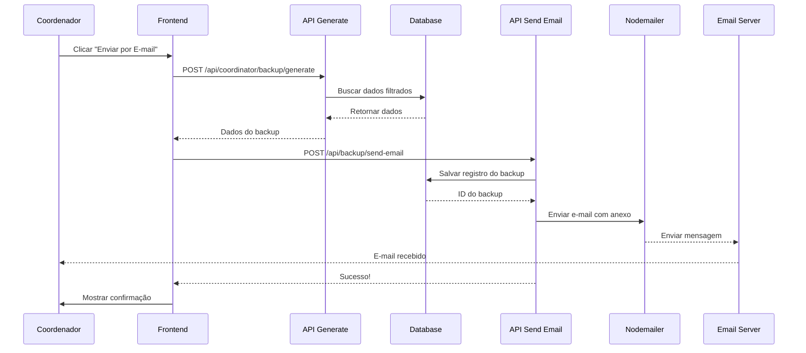

# 📧 Sistema de Envio de Backup por E-mail - Documentação

## 🎯 Funcionalidade Implementada

O sistema agora envia automaticamente backups de atendimentos por e-mail para o coordenador, com template HTML profissional e arquivo JSON anexado.

---

## ✨ Características

### 1️⃣ E-mail Profissional
- ✅ Template HTML responsivo e visual
- ✅ Informações detalhadas do backup
- ✅ Botão de download do backup
- ✅ Lista de tabelas incluídas
- ✅ Badges dos estudantes afetados
- ✅ Avisos de segurança

### 2️⃣ Anexo JSON
- ✅ Arquivo JSON formatado
- ✅ Nome padronizado: `backup_naf_YYYY-MM-DD_ID.json`
- ✅ Contém todos os dados do backup
- ✅ Metadados completos

### 3️⃣ Link de Download
- ✅ Link temporário para download
- ✅ Válido por 7 dias
- ✅ Rota segura: `/api/backup/download/[id]`

---

## 🔧 Como Usar

### Passo 1: Acessar Painel do Coordenador

```
1. Login como coordenador
2. Ir para: Dashboard → Backup Atendimentos
3. Configurar filtros (opcional):
   - Status dos atendimentos
   - Período de datas
   - Incluir feedbacks
```

### Passo 2: Enviar por E-mail

```
1. Rolar até a seção "Enviar por E-mail"
2. Verificar e-mail de destino (pré-preenchido com e-mail do coordenador)
3. Adicionar mensagem opcional (se desejar)
4. Clicar em "Enviar por E-mail"
5. Aguardar confirmação
```

### Passo 3: Verificar E-mail

```
1. Abrir caixa de entrada
2. Procurar por: "🛡️ Backup NAF - DD/MM/YYYY"
3. Abrir o e-mail
4. Verificar informações do backup
5. Baixar anexo JSON ou clicar no botão de download
```

---

## 📋 Informações no E-mail

### Cabeçalho
```
🛡️ Backup de Dados Realizado
Sistema NAF - Núcleo de Apoio Contábil e Fiscal

⚠️ Operação Crítica Executada
Este é um backup automático gerado antes da exclusão de dados
```

### Dados do Backup
- **Data do Backup**: DD/MM/YYYY
- **Hora**: HH:MM:SS
- **Total de Registros**: N registros
- **Status**: SUCESSO ✅

### Tabelas Incluídas
Lista completa de todas as tabelas:
- 📋 fiscal_appointments
- 📋 students
- 📋 feedbacks
- 📋 (... outras tabelas)

### Estudantes Afetados
Badges visuais com nomes dos estudantes:
```
[João Silva] [Maria Santos] [Pedro Costa] ...
```

### Botão de Download
```
⬇️ Baixar Backup Completo
(Link clicável para download direto)
```

### Detalhes Técnicos
- **ID do Backup**: backup-1234567890
- **Tipo**: Backup Automático
- **Formato**: JSON
- **Compressão**: Habilitada
- **Coordenador**: Nome do Coordenador
- **Email**: coordenador@naf.edu.br

### Aviso de Segurança
```
🔒 Este backup contém dados sensíveis e deve ser armazenado 
em local seguro. Não compartilhe com pessoas não autorizadas.
O link de download expira em 7 dias.
```

---

## 📄 Formato do Arquivo JSON

```json
{
  "metadata": {
    "version": "1.0",
    "backup_id": "backup-1234567890",
    "exported_at": "2025-10-26T14:30:00.000Z",
    "coordinator": {
      "name": "João Coordenador",
      "email": "coordenador@naf.edu.br"
    },
    "total_records": 150,
    "tables_count": 5,
    "students_count": 25
  },
  "data": {
    "fiscal_appointments": [...],
    "students": [...],
    "feedbacks": [...],
    ...
  },
  "students": [
    {
      "id": "student-1",
      "name": "João Silva",
      "email": "joao@example.com"
    },
    ...
  ]
}
```

---

## 🔄 Fluxo Completo



---

## 🧪 Como Testar

### Teste 1: Envio Básico

```
1. Login como coordenador
2. Ir para "Backup Atendimentos"
3. Não alterar nenhum filtro (usar padrões)
4. Clicar em "Enviar por E-mail"
5. Aguardar mensagem de sucesso
6. Verificar e-mail recebido
7. Baixar anexo JSON
8. Abrir e verificar conteúdo
```

**✅ Resultado Esperado**:
- E-mail recebido em menos de 1 minuto
- Template HTML bonito e profissional
- Anexo JSON presente
- Todas as informações corretas

---

### Teste 2: Com Filtros

```
1. Aplicar filtros:
   - Status: PENDENTE + CONFIRMADO
   - Data: Últimos 30 dias
   - Incluir Feedbacks: ✅
2. Clicar em "Enviar por E-mail"
3. Verificar e-mail
4. Conferir se dados correspondem aos filtros
```

**✅ Resultado Esperado**:
- Apenas registros filtrados no backup
- Total de registros reflete o filtro
- Feedbacks incluídos (se houver)

---

### Teste 3: E-mail Personalizado

```
1. Alterar e-mail de destino
2. Adicionar mensagem personalizada
3. Enviar
4. Verificar recebimento no e-mail alternativo
```

**✅ Resultado Esperado**:
- E-mail enviado para endereço especificado
- Mensagem personalizada aparece (se implementado)

---

### Teste 4: Download do Link

```
1. Receber e-mail
2. Clicar no botão "⬇️ Baixar Backup Completo"
3. Verificar se download inicia
4. Abrir arquivo baixado
5. Verificar conteúdo JSON
```

**✅ Resultado Esperado**:
- Link funciona corretamente
- Arquivo baixado com nome correto
- JSON válido e formatado
- Conteúdo igual ao anexo

---

## 🔐 Configuração de E-mail

### Variáveis de Ambiente Necessárias

```env
# Gmail (ou outro provedor)
EMAIL_USER=naf.contabilidade@gmail.com
EMAIL_PASS=sua-senha-de-app

# URL do aplicativo (para links)
NEXT_PUBLIC_APP_URL=https://naf.ltdestacio.com.br
```

### Configurar Senha de App (Gmail)

```
1. Acessar: https://myaccount.google.com/apppasswords
2. Login na conta do Gmail
3. Clicar em "Gerar senha de app"
4. Nome: "NAF Contabilidade Backup"
5. Copiar a senha gerada (16 caracteres)
6. Adicionar em EMAIL_PASS no .env
```

---

## 📊 Logs e Monitoramento

### Logs no Console (Servidor)

```bash
📧 Iniciando envio de backup por e-mail...
💾 Backup salvo: backup-1234567890
📧 Enviando e-mail para: coordenador@naf.edu.br
✅ E-mail enviado: <message-id@gmail.com>
```

### Logs no Banco de Dados

```sql
SELECT * FROM backups 
WHERE backup_type = 'email' 
ORDER BY created_at DESC 
LIMIT 10;
```

### Mensagem de Sucesso (Frontend)

```
✅ Backup enviado com sucesso para coordenador@naf.edu.br!
📊 150 registros exportados
📋 5 tabelas incluídas
👥 25 estudantes
📥 Arquivo: backup_naf_2025-10-26_backup-1234567890.json
```

---

## ⚠️ Solução de Problemas

### Problema: E-mail não chega

**Verificar**:
1. Variáveis EMAIL_USER e EMAIL_PASS estão corretas?
2. Senha de app foi gerada no Gmail?
3. Conta Gmail permite apps menos seguros?
4. E-mail não está na pasta de spam?

**Solução**:
```bash
# Testar credenciais manualmente
node -e "
const nodemailer = require('nodemailer');
const transport = nodemailer.createTransport({
  service: 'gmail',
  auth: { user: 'EMAIL', pass: 'SENHA' }
});
transport.verify().then(console.log).catch(console.error);
"
```

---

### Problema: Anexo não aparece

**Verificar**:
1. Backup foi gerado corretamente?
2. Tamanho do arquivo não excede limite?
3. Formato JSON está correto?

**Solução**:
- Verificar logs do servidor
- Testar geração de backup separadamente
- Verificar limite de tamanho do provedor (Gmail: 25MB)

---

### Problema: Link de download não funciona

**Verificar**:
1. Backup foi salvo no banco?
2. ID do backup está correto?
3. Rota `/api/backup/download/[id]` existe?
4. Tabela `backups` existe no banco?

**Solução**:
```sql
-- Verificar se backup existe
SELECT * FROM backups WHERE id = 'backup-1234567890';

-- Se não existe, verificar em system_backups
SELECT * FROM system_backups WHERE id = 'backup-1234567890';
```

---

### Problema: Erro 500 ao enviar

**Possíveis causas**:
- Configuração de e-mail incorreta
- Tabela `backups` não existe
- Dados do backup inválidos
- Template HTML não encontrado

**Debug**:
```bash
# Ver logs completos
tail -f .next/server-logs.log

# Ou verificar console do Vercel/Netlify
```

---

## 📁 Arquivos Modificados/Criados

1. **`src/app/api/backup/send-email/route.ts`** ← Nova API
2. **`src/app/api/backup/download/[id]/route.ts`** ← Atualizado
3. **`src/components/coordinator/BackupCenter.tsx`** ← Atualizado
4. **`email-backup-template-old.html`** ← Template usado

---

## 🎨 Template HTML

O template utilizado é o `email-backup-template-old.html` com os seguintes placeholders:

- `{{backup_date}}` - Data do backup (DD/MM/YYYY)
- `{{backup_time}}` - Hora do backup (HH:MM:SS)
- `{{total_records}}` - Total de registros
- `{{backup_status}}` - Status (SUCESSO/ERRO)
- `{{status_class}}` - Classe CSS (status-success/status-error)
- `{{tables_list}}` - Lista HTML de tabelas
- `{{students_badges}}` - Badges HTML dos estudantes
- `{{download_link}}` - Link para download
- `{{backup_id}}` - ID do backup
- `{{coordinator_name}}` - Nome do coordenador
- `{{coordinator_email}}` - E-mail do coordenador

---

## ✅ Checklist de Implementação

- [x] API de envio de e-mail criada
- [x] Template HTML configurado
- [x] Substituição de placeholders
- [x] Anexo JSON implementado
- [x] Link de download gerado
- [x] Registro no banco de dados
- [x] Integração com frontend
- [x] Logs de debug
- [x] Tratamento de erros
- [x] Mensagens de sucesso/erro
- [ ] Teste completo em produção
- [ ] Configuração de variáveis de ambiente
- [ ] Documentação para usuário final

---

## 🚀 Próximos Passos

1. **Configurar variáveis de ambiente** em produção (Vercel/Netlify)
2. **Testar envio** em ambiente de produção
3. **Ajustar template** se necessário (cores, textos)
4. **Implementar expiração** de links de download (opcional)
5. **Adicionar estatísticas** de e-mails enviados (opcional)
6. **Criar notificações** de backup agendado (opcional)

---

## 📞 Suporte

Se encontrar problemas:

1. Verificar logs do servidor
2. Conferir variáveis de ambiente
3. Testar credenciais de e-mail
4. Verificar tabelas do banco
5. Consultar documentação do nodemailer

**Documentação Nodemailer**: https://nodemailer.com/

---

## 🎉 Resultado Final

Sistema profissional de backup com:
✅ E-mail automático bonito e funcional
✅ Anexo JSON completo
✅ Link de download seguro
✅ Informações detalhadas
✅ Fácil de usar
✅ Seguro e confiável

**Sistema pronto para uso em produção! 🚀**
