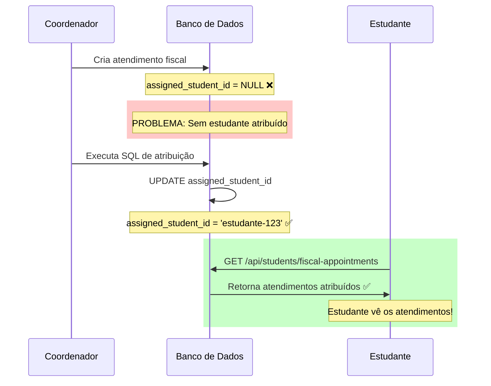

Human: # 🔍 PROBLEMA: Atendimentos não aparecem para o Estudante

## 📋 Sintomas

- ✅ **Coordenador**: Vê os atendimentos fiscais rapidamente no painel
- ❌ **Estudante**: NÃO vê os atendimentos ou demora muito para aparecer

---

## 🎯 Causa Raiz Identificada

O problema ocorre porque **os atendimentos fiscais não estão sendo atribuídos aos estudantes** quando são criados.

### Como funciona atualmente:

1. **Coordenador cria atendimento fiscal**
   - Campo `assigned_student_id` fica `NULL` (vazio)
   
2. **API do estudante busca atendimentos**
   ```typescript
   // src/app/api/students/fiscal-appointments/route.ts
   .eq('assigned_student_id', studentId)  // ❌ Não encontra nada!
   ```

3. **Resultado**: Estudante não vê nada no painel

---

## ✅ SOLUÇÃO

Você precisa **atribuir os atendimentos aos estudantes**. Há 2 formas:

### Opção 1: SQL Automático (Recomendado)

1. **Diagnosticar o problema:**
   - Acesse Supabase Dashboard → SQL Editor
   - Copie e execute: `src/sql/diagnostico_atendimentos_estudante.sql`
   - Veja quantos atendimentos estão SEM estudante

2. **Atribuir automaticamente:**
   - Copie e execute: `src/sql/atribuir_atendimentos_automaticamente.sql`
   - Escolha uma opção:
     - **OPÇÃO 1** (padrão): Atribui todos ao primeiro estudante
     - **OPÇÃO 2** (comentada): Distribui igualmente entre todos
     - **OPÇÃO 3** (comentada): Apenas atendimentos recentes

3. **Verificar:**
   - Estudante faz login
   - ✅ Atendimentos aparecem no painel!

### Opção 2: Interface do Coordenador (Futuro)

Criar uma interface no painel do coordenador para:
- Ver atendimentos não atribuídos
- Selecionar estudante
- Atribuir manualmente

---

## 🔧 Passos Detalhados

### 1. Diagnosticar

```sql
-- Abra: Supabase Dashboard > SQL Editor
-- Cole e execute:

SELECT 
    COUNT(*) as total,
    COUNT(assigned_student_id) as com_estudante,
    COUNT(*) - COUNT(assigned_student_id) as sem_estudante
FROM fiscal_appointments;
```

**Resultado esperado:**
```
total | com_estudante | sem_estudante
------|---------------|---------------
  50  |       0       |      50       ← ❌ PROBLEMA!
```

### 2. Ver Estudantes Cadastrados

```sql
SELECT id, name, email, course
FROM students
ORDER BY created_at DESC;
```

**Anote o ID do estudante** que deve receber os atendimentos.

### 3. Atribuir Manualmente (Alternativa rápida)

```sql
-- Substitua 'SEU_ESTUDANTE_ID' pelo ID do passo 2
UPDATE fiscal_appointments
SET 
    assigned_student_id = 'SEU_ESTUDANTE_ID',
    updated_at = NOW()
WHERE assigned_student_id IS NULL;
```

### 4. Verificar

```sql
SELECT 
    s.name as estudante,
    COUNT(fa.id) as total_atendimentos
FROM students s
LEFT JOIN fiscal_appointments fa ON fa.assigned_student_id = s.id
GROUP BY s.id, s.name;
```

**Resultado esperado:**
```
estudante       | total_atendimentos
----------------|-------------------
João Silva      |        50         ← ✅ SUCESSO!
```

---

## 🎨 Fluxo Corrigido



---

## 📊 Estrutura da Tabela

```sql
CREATE TABLE fiscal_appointments (
    id UUID PRIMARY KEY,
    protocol TEXT,
    service_title TEXT,
    client_name TEXT,
    status TEXT DEFAULT 'PENDENTE',
    assigned_student_id UUID,  -- ⚠️ ESTE CAMPO PRECISA SER PREENCHIDO!
    created_at TIMESTAMPTZ DEFAULT NOW(),
    updated_at TIMESTAMPTZ DEFAULT NOW()
);
```

---

## 🚨 Prevenção Futura

Para evitar que isso aconteça novamente, você pode:

### 1. **Atribuição Automática via Trigger**

Criar um trigger que atribui automaticamente ao criar:

```sql
-- Criar função para atribuir automaticamente
CREATE OR REPLACE FUNCTION auto_assign_student()
RETURNS TRIGGER AS $$
DECLARE
    first_student_id UUID;
BEGIN
    -- Se não tem estudante atribuído, pegar o primeiro
    IF NEW.assigned_student_id IS NULL THEN
        SELECT id INTO first_student_id
        FROM students
        ORDER BY created_at ASC
        LIMIT 1;
        
        NEW.assigned_student_id := first_student_id;
    END IF;
    
    RETURN NEW;
END;
$$ LANGUAGE plpgsql;

-- Criar trigger
DROP TRIGGER IF EXISTS trigger_auto_assign_student ON fiscal_appointments;
CREATE TRIGGER trigger_auto_assign_student
    BEFORE INSERT ON fiscal_appointments
    FOR EACH ROW
    EXECUTE FUNCTION auto_assign_student();
```

### 2. **Interface de Atribuição no Coordenador**

Adicionar no painel do coordenador:
- Lista de atendimentos não atribuídos
- Dropdown para selecionar estudante
- Botão "Atribuir"

### 3. **Validação na API**

Modificar a API que cria atendimentos para exigir `assigned_student_id`:

```typescript
// src/app/api/coordinator/fiscal-appointments/route.ts
if (!assigned_student_id) {
  return NextResponse.json(
    { error: 'É obrigatório atribuir um estudante' },
    { status: 400 }
  )
}
```

---

## 📝 Checklist de Resolução

- [ ] 1. Executar `diagnostico_atendimentos_estudante.sql`
- [ ] 2. Confirmar que há atendimentos SEM estudante
- [ ] 3. Verificar que há estudantes cadastrados
- [ ] 4. Executar `atribuir_atendimentos_automaticamente.sql`
- [ ] 5. Ver mensagem de sucesso
- [ ] 6. Estudante fazer login
- [ ] 7. Estudante ver atendimentos no painel ✅
- [ ] 8. (Opcional) Implementar trigger automático
- [ ] 9. (Opcional) Criar interface de atribuição

---

## 🎯 Teste Rápido

```bash
# 1. Aplicar solução SQL (Supabase Dashboard)

# 2. Rodar projeto
npm run dev

# 3. Login como estudante
http://localhost:3000/student/login

# 4. Ir em "Atendimentos Fiscais"
# ✅ Deve ver os atendimentos agora!
```

---

## 📞 Ajuda Adicional

Se após executar os scripts SQL os atendimentos ainda não aparecerem:

1. **Verificar token do estudante:**
   ```sql
   -- Ver estudantes e seus IDs
   SELECT id, name, email FROM students;
   ```

2. **Verificar console do browser:**
   - F12 → Console
   - Procurar por erros na chamada da API

3. **Verificar logs do servidor:**
   - Terminal onde roda `npm run dev`
   - Procurar por erros ao buscar atendimentos

4. **Verificar no Supabase:**
   ```sql
   -- Ver atendimentos do estudante específico
   SELECT * FROM fiscal_appointments
   WHERE assigned_student_id = 'COLE_O_ID_AQUI';
   ```

---

## 📚 Arquivos Relacionados

- **Diagnóstico**: `src/sql/diagnostico_atendimentos_estudante.sql`
- **Solução**: `src/sql/atribuir_atendimentos_automaticamente.sql`
- **API Estudante**: `src/app/api/students/fiscal-appointments/route.ts`
- **Componente**: `src/components/student/StudentFiscalAppointments.tsx`

---

**Status**: ✅ Solução Pronta
**Próximo Passo**: Executar os scripts SQL no Supabase Dashboard
**Tempo estimado**: 5 minutos
