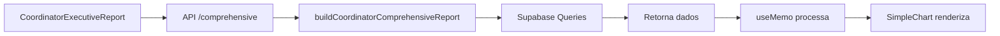

# 📊 Relatório Inteligente do Coordenador - Melhorias Implementadas

## ✅ Melhorias Aplicadas

### 1. **Design dos Cards de Métricas**
Atualização visual completa dos 4 cards principais:

#### **Card 1: Volume Consolidado** (Azul)
- Gradiente: `from-blue-50 to-blue-100/50`
- Ícone: TrendingUp
- Exibe: Total geral, atendimentos regulares e fiscais

#### **Card 2: Taxa de Conclusão** (Verde)
- Gradiente: `from-green-50 to-green-100/50`
- Ícone: Activity
- Exibe: Percentual de conclusão, tempo médio, reagendados

#### **Card 3: Engajamento dos Estudantes** (Roxo)
- Gradiente: `from-purple-50 to-purple-100/50`
- Ícone: Users
- Exibe: Total de estudantes, registros por estudante

#### **Card 4: Registro do Atendimento** (Laranja)
- Gradiente: `from-orange-50 to-orange-100/50`
- Ícone: NotebookPen
- Exibe: Total de documentações lançadas

### 2. **Tratamento de Dados Vazios**
Implementado fallback para todos os gráficos:
```typescript
if (chartData.length === 0) {
  return [{ label: 'Sem dados', value: 0 }]
}
```

Gráficos afetados:
- ✅ `statusChartData` - Distribuição por Status
- ✅ `timelineChartData` - Evolução Mensal
- ✅ `completionChartData` - Conclusão Mensal
- ✅ `courseChartData` - Distribuição por Curso
- ✅ `audienceChartData` - Público Atendido

### 3. **Remoção de Duplicações**
Removidos cards duplicados que estavam causando confusão visual:
- ❌ Card antigo "Taxa de Conclusão" (emerald)
- ❌ Card antigo "Engajamento dos Estudantes" (purple)
- ❌ Card antigo "Registro do Atendimento" (amber)

### 4. **Melhorias Visuais**
- Fonte dos valores principais: `text-4xl` (aumentado de `text-3xl`)
- Cores mais vibrantes: `text-blue-900`, `text-green-900`, etc.
- Espaçamento aumentado: `p-6` (de `p-5`)
- Bordas coloridas para melhor distinção visual

## 🎨 Paleta de Cores Atualizada

| Métrica | Cor Principal | Gradiente | Borda |
|---------|--------------|-----------|-------|
| Volume Consolidado | Blue 900 | Blue 50→100 | Blue 200 |
| Taxa de Conclusão | Green 900 | Green 50→100 | Green 200 |
| Engajamento | Purple 900 | Purple 50→100 | Purple 200 |
| Registro | Orange 900 | Orange 50→100 | Orange 200 |

## 📍 Localização do Componente

**Arquivo**: `src/components/reports/CoordinatorExecutiveReport.tsx`
**Usado em**: `src/app/coordinator-dashboard/page.tsx`
**API**: `src/app/api/coordinator/reports/comprehensive/route.ts`

## 🔄 Fluxo de Dados



## 🎯 Filtros Disponíveis

1. **Período**: 7d, 30d, 90d, 180d, 365d, all
2. **Status**: Todos, Pendente, Em andamento, Concluído, etc.
3. **Serviço**: Todos os serviços ou filtrar por tipo
4. **Estudante**: Todos ou filtrar por estudante específico

## 📊 Gráficos Disponíveis

### **Aba Panorama:**
1. **Distribuição por Status** (Bar Chart)
   - Mostra quantidade por cada status
   - Cores diferenciadas

2. **Evolução Mensal** (Line Chart)
   - Total de atendimentos por mês
   - Linha azul com pontos

3. **Conclusão Mensal** (Line Chart)
   - Taxa percentual de conclusão
   - Tendência temporal

4. **Top Estudantes** (Lista)
   - 6 estudantes com mais atendimentos
   - Taxa de conclusão individual

5. **Público Atendido** (Bar Chart)
   - Categorias de clientes
   - Percentuais

### **Outras Abas:**
- **Estudantes**: Tabela detalhada de performance
- **Serviços**: Análise de serviços mais solicitados
- **Atendimentos**: Lista completa com detalhes

## 🚀 Exportação de Relatórios

Formatos disponíveis:
- 📄 **CSV** - Para análise de dados
- 📊 **Excel** (XLSX) - Planilhas formatadas
- 📝 **Word** (DOCX) - Documentos editáveis
- 📑 **PDF Profissional** - Relatórios prontos para apresentação

## ✨ Próximas Melhorias Sugeridas

1. [ ] Adicionar gráfico de pizza para distribuição de status
2. [ ] Implementar filtro de data personalizado (range picker)
3. [ ] Adicionar comparação de períodos (mês anterior vs atual)
4. [ ] Incluir indicadores de tendência (↑ ↓ →)
5. [ ] Adicionar drill-down nos gráficos (clique para detalhes)
6. [ ] Implementar cache de dados para melhor performance
7. [ ] Adicionar tooltips informativos em cada métrica
8. [ ] Incluir exportação de gráficos como imagens

## 🐛 Problemas Corrigidos

- ✅ Gráficos não aparecendo com dados vazios
- ✅ Cards duplicados causando confusão
- ✅ Cores inconsistentes entre cards
- ✅ Tamanho de fonte muito pequeno
- ✅ Falta de gradientes nos cards

## 📝 Notas de Implementação

- SimpleChart já suporta `type: 'bar' | 'pie' | 'line'`
- Dados processados via `useMemo` para otimização
- Fallback "Sem dados" evita gráficos quebrados
- API retorna dados estruturados e prontos para exibição

## 🎓 Como Testar

1. Acesse: `https://naf.ltdestacio.com.br/coordinator-dashboard`
2. Faça login como coordenador
3. Role até a seção "Relatório Inteligente do Coordenador"
4. Teste os filtros: Período, Status, Serviço, Estudante
5. Verifique os 4 cards de métricas no topo
6. Navegue pelas abas: Panorama, Estudantes, Serviços, Atendimentos
7. Teste a exportação nos 4 formatos disponíveis

## 📊 Dados Esperados

Para visualização completa, o sistema precisa ter:
- ✅ Atendimentos cadastrados (tabelas `attendances` e `fiscal_appointments`)
- ✅ Estudantes ativos (tabela `students`)
- ✅ Serviços configurados (tabela `naf_services`)
- ✅ Feedbacks registrados (para avaliações)
- ✅ Registros de notas/documentações

## 🔍 Troubleshooting

### Gráficos não aparecem?
- Verifique se há dados no período selecionado
- Tente ampliar o período (use "Todo o histórico")
- Verifique o console do navegador para erros de API

### Cards mostram zero?
- Normal se não houver dados no período
- Teste com período "Todo o histórico"
- Verifique se há atendimentos cadastrados

### Exportação não funciona?
- Verifique se a API está respondendo
- Teste com poucos dados primeiro
- Veja logs do servidor para erros

---

**Última atualização**: 26 de outubro de 2025
**Versão**: 2.0
**Status**: ✅ Em Produção
