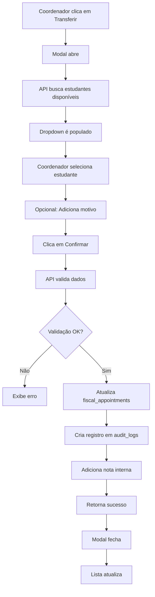

# 🔄 Sistema de Transferência de Atendimentos Entre Estudantes

## 📋 Visão Geral

Sistema completo que permite ao **coordenador** transferir atendimentos fiscais de um estudante para outro, com rastreamento completo de auditoria e validações de segurança.

---

## 🎯 Funcionalidades Implementadas

### 1. **API de Transferência**
- **Endpoint**: `POST /api/fiscal-appointments/transfer`
- **Validações**:
  - ✅ Verifica se o agendamento existe
  - ✅ Valida status permitidos (CONFIRMADO, EM_ANDAMENTO, AGENDADO)
  - ✅ Confirma que o novo estudante está ativo
  - ✅ Registra log de auditoria completo
- **Retorno**: Dados do atendimento atualizado + informações da transferência

### 2. **API de Estudantes Disponíveis**
- **Endpoint**: `GET /api/fiscal-appointments/transfer?current_student_id={id}`
- **Funcionalidade**:
  - Lista todos os estudantes ativos
  - Exclui o estudante atual (se fornecido)
  - Retorna: nome, email, curso, semestre, status
  - Ordenação alfabética por nome

### 3. **Tabela de Auditoria**
- **Tabela**: `appointment_audit_logs`
- **Campos**:
  - `id`: UUID único
  - `appointment_id`: ID do atendimento
  - `from_student_id`: Estudante original
  - `to_student_id`: Novo estudante
  - `coordinator_id`: Quem fez a transferência
  - `action`: Tipo de ação (TRANSFER_STUDENT)
  - `reason`: Motivo da transferência
  - `timestamp`: Data/hora da operação
- **Políticas RLS**: Coordenadores podem visualizar, sistema pode inserir

### 4. **Interface do Coordenador**
- **Localização**: Componente `FiscalAppointmentsSection`
- **Botão**: "Transferir" (aparece apenas para status permitidos)
- **Modal de Transferência**:
  - Informações do atendimento atual
  - Dropdown com estudantes disponíveis
  - Campo de motivo (opcional)
  - Validação em tempo real
  - Feedback visual durante a operação

---

## 🔐 Regras de Negócio

### Status Permitidos para Transferência
```typescript
const allowedStatuses = ['CONFIRMADO', 'EM_ANDAMENTO', 'AGENDADO']
```

**Por quê?**
- **PENDENTE**: Ainda não foi aceito por nenhum estudante
- **CONCLUIDO**: Já foi finalizado, não pode ser alterado
- **CANCELADO**: Atendimento foi cancelado

### Validações de Segurança
1. ✅ Estudante destino deve estar **ativo** no sistema
2. ✅ Atendimento deve existir e estar em status válido
3. ✅ Coordenador deve estar autenticado
4. ✅ Motivo da transferência é registrado para auditoria
5. ✅ Nota interna é atualizada com histórico completo

---

## 📁 Arquivos Criados/Modificados

### Novos Arquivos
1. **`src/app/api/fiscal-appointments/transfer/route.ts`** (229 linhas)
   - API POST para executar transferência
   - API GET para listar estudantes disponíveis
   - Validações completas
   - Log de auditoria

2. **`database/migrations/20250127_criar_tabela_auditoria_transferencias.sql`** (96 linhas)
   - Cria tabela `appointment_audit_logs`
   - Índices para performance
   - Políticas RLS
   - Foreign keys

3. **`doc/SISTEMA_TRANSFERENCIA_ATENDIMENTOS.md`** (este arquivo)
   - Documentação completa
   - Guia de uso
   - Exemplos de API

### Arquivos Modificados
1. **`src/components/FiscalAppointmentsSection.tsx`**
   - Adicionado botão "Transferir"
   - Modal de transferência completo
   - Estados para gerenciar transferência
   - Funções `openTransferModal()` e `executeTransfer()`

---

## 🚀 Como Usar

### Passo 1: Executar Migration SQL
```sql
-- Acesse o Supabase SQL Editor
-- Cole o conteúdo de:
database/migrations/20250127_criar_tabela_auditoria_transferencias.sql

-- Execute o script
```

### Passo 2: Acessar Interface
1. Fazer login como **Coordenador**
2. Acessar dashboard do coordenador
3. Rolar até seção **"Solicitações de Agendamento Fiscal"**
4. Localizar atendimentos com status **CONFIRMADO** ou **EM_ANDAMENTO**
5. Clicar no botão **"Transferir"** (ícone ⇄)

### Passo 3: Executar Transferência
1. **Modal abre** com informações do atendimento
2. **Selecionar** novo estudante no dropdown
3. **Opcional**: Adicionar motivo da transferência
4. Clicar em **"Confirmar Transferência"**
5. Aguardar feedback de sucesso
6. Lista é **atualizada automaticamente**

---

## 🧪 Exemplos de API

### Buscar Estudantes Disponíveis
```bash
GET /api/fiscal-appointments/transfer?current_student_id=abc-123-def

# Resposta:
{
  "students": [
    {
      "id": "xyz-789-ghi",
      "name": "João Silva",
      "email": "joao@email.com",
      "course": "Ciências Contábeis",
      "semester": "7º Período",
      "status": "active"
    }
  ],
  "total": 15
}
```

### Executar Transferência
```bash
POST /api/fiscal-appointments/transfer
Content-Type: application/json

{
  "appointment_id": "uuid-do-atendimento",
  "from_student_id": "uuid-estudante-antigo",
  "to_student_id": "uuid-novo-estudante",
  "reason": "Redistribuição de carga de trabalho"
}

# Resposta de Sucesso:
{
  "success": true,
  "message": "Atendimento transferido com sucesso",
  "appointment": {
    "id": "...",
    "protocol": "FAP-20250127-1234",
    "assigned_student_id": "uuid-novo-estudante",
    "students": {
      "name": "João Silva",
      "email": "joao@email.com"
    }
  },
  "transfer": {
    "from": "uuid-estudante-antigo",
    "to": "uuid-novo-estudante",
    "new_student": {
      "id": "uuid-novo-estudante",
      "name": "João Silva",
      "email": "joao@email.com"
    }
  }
}

# Resposta de Erro:
{
  "error": "Só é possível transferir atendimentos confirmados ou em andamento",
  "current_status": "CANCELADO"
}
```

---

## 📊 Fluxo de Transferência



---

## 🔍 Auditoria e Rastreamento

### Registro de Auditoria
Toda transferência gera um registro em `appointment_audit_logs`:
```sql
SELECT 
  a.timestamp,
  a.action,
  a.reason,
  fs.name as from_student,
  ts.name as to_student,
  fa.protocol,
  fa.service_title
FROM appointment_audit_logs a
JOIN fiscal_appointments fa ON fa.id = a.appointment_id
LEFT JOIN students fs ON fs.id = a.from_student_id
JOIN students ts ON ts.id = a.to_student_id
ORDER BY a.timestamp DESC;
```

### Nota Interna Atualizada
Cada transferência adiciona ao campo `internal_notes`:
```
[27/01/2025 14:30] Atendimento transferido para: João Silva (joao@email.com)
Motivo: Redistribuição de carga de trabalho
```

---

## ⚠️ Tratamento de Erros

### Erros Comuns e Soluções

| Erro | Causa | Solução |
|------|-------|---------|
| "ID do agendamento não fornecido" | Campo `appointment_id` vazio | Verificar interface |
| "ID do novo estudante não fornecido" | Não selecionou estudante | Escolher no dropdown |
| "Agendamento não encontrado" | ID inválido | Verificar banco de dados |
| "Só é possível transferir atendimentos confirmados" | Status inválido | Ver status permitidos |
| "Estudante não encontrado ou inativo" | Estudante inexistente/inativo | Verificar tabela students |
| "Estudante não está ativo no sistema" | Status != 'active' | Ativar estudante primeiro |

---

## 🎨 Interface Visual

### Botão de Transferência
- **Cor**: Azul claro (`border-blue-300 text-blue-700`)
- **Ícone**: ⇄ (ArrowRightLeft)
- **Posicionamento**: Ao lado de "Visualizar" e "Confirmar"
- **Visibilidade**: Apenas para status válidos

### Modal de Transferência
- **Largura**: `max-w-2xl` (responsivo)
- **Altura**: Até 90vh (scroll interno)
- **Seções**:
  1. Header com protocolo
  2. Card com info do atendimento
  3. Dropdown de estudantes
  4. Campo de motivo (textarea)
  5. Footer com botões de ação

---

## 📈 Métricas e Relatórios

### Consultas Úteis

**Total de transferências por estudante:**
```sql
SELECT 
  s.name,
  COUNT(CASE WHEN a.from_student_id = s.id THEN 1 END) as transferidos_de,
  COUNT(CASE WHEN a.to_student_id = s.id THEN 1 END) as transferidos_para
FROM students s
LEFT JOIN appointment_audit_logs a ON a.from_student_id = s.id OR a.to_student_id = s.id
GROUP BY s.id, s.name
ORDER BY transferidos_para DESC;
```

**Transferências por motivo:**
```sql
SELECT 
  reason,
  COUNT(*) as total
FROM appointment_audit_logs
WHERE action = 'TRANSFER_STUDENT'
GROUP BY reason
ORDER BY total DESC;
```

**Histórico completo de um atendimento:**
```sql
SELECT 
  fa.protocol,
  fa.service_title,
  fa.status,
  s.name as current_student,
  (
    SELECT json_agg(json_build_object(
      'timestamp', a.timestamp,
      'from', fs.name,
      'to', ts.name,
      'reason', a.reason
    ) ORDER BY a.timestamp)
    FROM appointment_audit_logs a
    LEFT JOIN students fs ON fs.id = a.from_student_id
    JOIN students ts ON ts.id = a.to_student_id
    WHERE a.appointment_id = fa.id
  ) as transfer_history
FROM fiscal_appointments fa
LEFT JOIN students s ON s.id = fa.assigned_student_id
WHERE fa.id = 'uuid-do-atendimento';
```

---

## 🛠️ Manutenção

### Limpeza de Logs Antigos (Opcional)
```sql
-- Deletar logs com mais de 1 ano
DELETE FROM appointment_audit_logs
WHERE timestamp < NOW() - INTERVAL '1 year';
```

### Backup de Auditoria
```sql
-- Exportar para CSV
COPY (
  SELECT * FROM appointment_audit_logs
  WHERE timestamp >= '2025-01-01'
) TO '/caminho/audit_backup_2025.csv' CSV HEADER;
```

---

## ✅ Checklist de Implementação

- [x] Criar API POST /transfer
- [x] Criar API GET /transfer
- [x] Criar tabela de auditoria
- [x] Configurar RLS policies
- [x] Adicionar botão na interface
- [x] Implementar modal de transferência
- [x] Validações de segurança
- [x] Feedback visual
- [x] Tratamento de erros
- [x] Documentação completa
- [ ] **EXECUTAR migration SQL no Supabase**
- [ ] **Testar fluxo completo**
- [ ] **Verificar permissões RLS**

---

## 🎓 Casos de Uso

### Caso 1: Redistribuição de Carga
**Cenário**: Estudante A está sobrecarregado com 10 atendimentos, Estudante B tem apenas 2.
**Solução**: Coordenador transfere 3 atendimentos de A para B.

### Caso 2: Especialização
**Cenário**: Atendimento de CNPJ complexo precisa de estudante com mais experiência.
**Solução**: Transferir para estudante veterano especializado.

### Caso 3: Indisponibilidade
**Cenário**: Estudante ficou doente e não pode concluir atendimento iniciado.
**Solução**: Transferir para outro estudante ativo.

---

## 📞 Suporte

### Problemas Comuns
1. **Botão não aparece**: Verificar status do atendimento
2. **Lista vazia**: Nenhum estudante ativo no sistema
3. **Erro 500**: Verificar logs do Supabase e estrutura do banco

### Logs para Debug
```typescript
// No navegador (Console)
console.log('Estudantes disponíveis:', availableStudents)
console.log('Atendimento selecionado:', selectedAppointment)

// No servidor (API)
console.log('📤 Transferência de atendimento:', { appointment_id, to_student_id })
```

---

## 🏆 Benefícios do Sistema

1. **✅ Transparência**: Todo histórico registrado
2. **✅ Flexibilidade**: Coordenador tem controle total
3. **✅ Auditoria**: Rastreamento completo de mudanças
4. **✅ Segurança**: Validações em múltiplas camadas
5. **✅ UX**: Interface intuitiva e feedback claro
6. **✅ Performance**: Índices otimizados no banco

---

## 📅 Data de Criação
**27 de Janeiro de 2025**

## 👤 Desenvolvido para
**NAF Contábil - Sistema de Atendimentos Fiscais**

---

*Sistema desenvolvido com Next.js 14, TypeScript, Supabase PostgreSQL e TailwindCSS*
